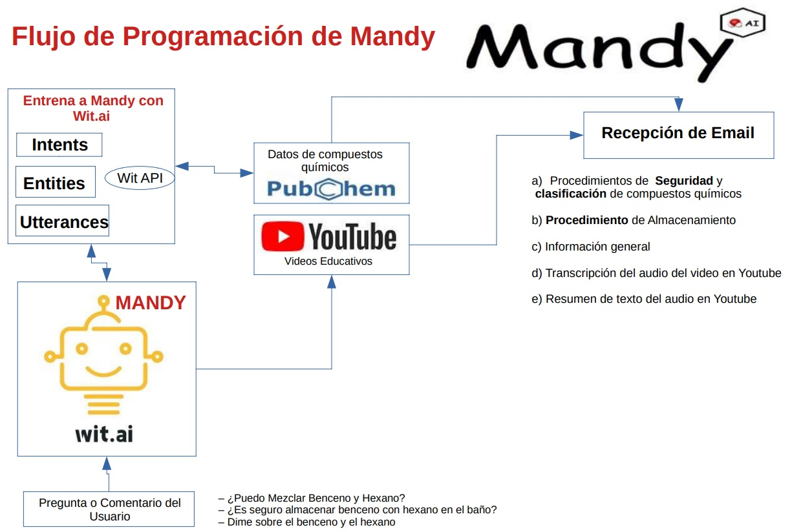

# Introducción - Mandy, la Acompañante Inteligente 

La química está en todas partes y fabricantes transforman las materias primas en productos finales usando el conocimiento de la química y propiedades físicas de esas materias primas. Los productos finales se venden en las tiendas y tienen química que puede funcionar a nuestro favor o en nuestra contra. Por ello, es destacable conocer los ingredientes y la química que contienen los productos manufacturados. Esto permitiran usarlos más seguramente y consumirlos de forma más confiable.

Los compuestos químicos existen en diferentes fases a temperaturas y presiones específicas en ambientes determinados. Por lo tanto, las personas o potenciales se entiende que los consumidores de productos podrían estar más interesadas en aprender sobre el manejo correcto de un producto que contiene un compuesto químico. Por ejemplo: los detergentes contienen una mezcla de sustancias químicas que podrían transformarse en otras sustancias químicas nocivas cuando se mezclan o almacenan en entornos estresantes. Como ama de casa, sería una decisión inteligente preguntarle a Mandy sobre algunos de los compuestos químicos que se almacenan en casa. Las lociones, cremas, maquillaje y muchos otros productos que se compran a diario también contienen sustancias químicas que quizás le interese conocer mejor antes de comprarlas.

Mandy utiliza la tecnología Wit.ai para ayudar a identificar si un usuario desea mezclar, almacenar o buscar más información sobre un compuesto químico. PubChem es la colección más grande del mundo de información química de libre acceso que proporciona alrededor de 100 millones de registros de compuestos químicos que son consultados para entrenar a Mandy y proveer de datos e información relevante que te llega en tu correo electrónico. Finalmente, los datos fiables obtenidos de PubChem se complementan con información práctica obtenida de la plataforma de YouTube. El resultado es un resumen en texto del audio completo del video y la texto completo del audio del video encontrado. La consulta hecha a YouTube sigue los algoritmos de inteligencia artificial que usa la plataforma para ofrecerte el video más adecuado para ver. Posteriormente se envía al correo electrónico del usuario la transcripción realizada del video.

La aplicación está dividida en tres secciones diferentes donde puedes integrar nuevo código de programación para hacer que Mandy sea más completa y útil para los usuarios potenciales. Como notarás, la aplicación contiene funciones que están directamente relacionadas con cada una de estas tres tecnologías, por lo que te será fácil identificar dónde puedes insertar nuevo código o modificar el existente.

Las secciones se mencionan en el orden en que funciona la aplicación y estas acciones comienzan después de recibir una pregunta o comentario del usuario:

    • Implementación de tecnología Wit.ai
    • Implementación de API de PubChem
    • Implementación de transcripción de audio de Youtube

## Implementación de tecnología Wit.ai

Mandy – El Acompañante Inteligente es una herramienta de inteligencia artificial que se programó en Python y que puede usarse para identificar situaciones en las que están involucrados compuestos químicos. Wit.ai es la tecnología que te hace identificar la intención de un usuario al recibir una pregunta o comentario al inicio de la aplicación.

Como puedes verificar, la tecnología Wit.ai identifica cuándo los usuarios están interesados ​​en hacer cosas que involucran conocer sobre la compatibilidad química, la intención de almacenamiento y sobre  información de un compuesto químico.

Específicamente, la aplicación identifica las siguientes intenciones:

    • Intención de búsqueda de compatibilidad química: el usuario desea conocer la compatibilidad química de un compuesto químico específico. El usuario conocera si es posible mezclar los compuestos  químicos, y saber sobre las precauciones de hacerlo.
    • Intención de almacenamiento: el usuario debe almacenar un compuesto químico o un producto que contenga un compuesto químico específico. El usuario descubre las precauciones de almacenamiento de este tipo de químicos
    • Intención de búsqueda de información: el usuario desea conocer las propiedades y características de un compuesto químico.
    

### Crear una cuenta Wit.ai

Primero debes crear una cuenta wit.ai para obtener un token de acceso para su aplicación. Escriba wit.ai en cualquier navegador con acceso a Internet y siga estos pasos:

    • Abre tu navegador en https://www.wit.ai
    • Haga clic en registrarse (login)
    • Ingresa un correo electrónico, nombre de usuario y contraseña
    • Verificar el correo electrónico registrado, dando clic al correo que Wit.ai te enviará.
    • Ingresa de nuevo a Wit.ai y haz clic en el botón crear una nueva aplicación (New App)

Al inicio del código de programación de Mandy encontraras la variable access_token_wit que debe contener el token que generó en su cuenta wit.ai para que pueda encontrar esta variable al comienzo del código de programación. Encontrarás un código como este:

access_token_wit='XXXXXXXXXXXXXXXXXX'

### Entrena a Mandy con datos

Una vez que haya obtenido su token de acceso, puede comenzar a entrenar a su robot para identificar los compuestos químicos y las intenciones del mensaje de los usuarios. Puede entrenar a su robot en el sitio web de wit.ai de manera manual y personalizda o utilizar la API de Wit.ai que se proporciona para automatizar el proceso de entrenamiento. 

Dado que es posible que requieras de cientos de datos para entrenar  tu robot puedes utilizar la API de PubChem en conjunto con la funciones que te presentamos a continuación. Estas funciones utilizan plantillas de excel donde se extrajeron datos de PubChem y se modificaron especialmente para ingresar los datos que Wit.ai y Mandy requieren durante el fase de entrenamiento. Para conocer más sobre el procedimiento de consumo de los enpoints de Wit.ai ingresa la siguiente dirección web https://wit.ai/docs dando clic en la sección de HTTP API.

Aquí puedes ver cómo implementar el registro de intents, entities, keywords, etc. a Wit.ai de forma automatica utilizando plantillas de Excel. En esencia los codigos de programación utilizan estructuras similares que puedes implementar en python para registrar tus datos en Wit.ai. La estructura y procedimiento son los siguientes:

    •Empieza por crear una función la cual se podria llamar por ejemplo: createIntent. Esto quedaria así def createIntent(): 
    •Identifica el endpoint que vas utilizar dependiendo si requieres registrar un Intent, Entity, Roles, Keyword, Synonyms o Utterance.Estos los encuentras aqui https://wit.ai/docs y un ejemplo del endpoint para registrar un Intent es https://api.wit.ai/intents
    • Obtén tu token de acceso en Wit.ai como te lo indicamos en la seccion anterior
    • Extrae datos de tu base de datos o archivo de Excel y guardalos en diccionarios usando la libreria de Pandas y Python para estructurar los diccionarios. Deberás de usar bucles para iterar sobre los datos y formar los diccionarios. Por ejemplo: la version final debe que dar de esta forma para roles (diccionario llamado data_roles): data_roles={'roles':roles[i]} y para keywords (diccionario llamado data_keyword): data_keyword={'keyword':keyword[i]}
    • Guarda los diccionarios estructurados en uno solo ya que este se enviará a la direccion del endpoint. Por ejemplo puedes crear un diccionario llamado data,asi: data={**data_roles,**data_keyword,**data_synonyms}
    • Estructura los headers del post necesario para el envío de datos. Este debe de tener tu token de acceso wit.ai generado y la indicación de que estarás trabajando con la estructura json. Por ejemplo: headers = {'authorization': 'Bearer ' + wit_access_token,'Content-Type': 'application/json'}
    • Ahora solamente es integrar el endpoint seleccionado, tus headers formados y el diccionario que estructuraste con tus datos para posteriormente enviar todo esto en un post con la libreria requests almacenando la respuesta obtenida de tu envío en la variable resp. Esto te quedaria de la siguiente forma:  resp=requests.post(API_ENDPOINT,headers=headers,json=data)
    • Para que puedas visualizar la respuesta obtenida de tu registro y saber si se registraron bien los datos utilizas la libreria json con los atributos loads y content. Esto quedaría así si se guarda en la variable data: data=json.loads(resp.content)
    • Finalmente, retorna la respuesta obtenida y almacenada en data fuera de la función, esto se hace incluyendo como línea final el comando: return data.

Este procedimiento se repiten de manera similar manera similar ya sea en los Entities, Roles, Keywords, Synonyms o Utterances que desees registrar para entrenar a Mandy. Así se enviría N número de datos o dicha de otra forma N número de preguntas, comentarios o solicitudes de usuarios en tu cuenta de Wit.ai para un mejor entrenamiento de Mandy.

Puede comparar y conocer sobre las similitudes y diferencias de los codigos de programación necesarios para postear datos en Wit.ai con el planteamiento estandar que te acabamos de mencionar. Recuerda que el endpoint más complicado que puedes estructurar es el Utterances. Los demás son más sencillos y fáciles de estruturar en tu código de programación.

Los codigos de programación que te presentaremos a continuación no tienen los fragmentos de codigo donde se extraen los datos desde excel. Estos archivos y codigos completos los puedes descargar aqui https://github.com/gibranscr/binder/tree/master solamente es que borres las líneas de código que tienen el signo # para que sea considerados como código activo. Las líneas las puedes identificar con los siguientes códigos:

#usando plantilla de excel 
#data_excel=pd.read_excel('wit-training-model.xlsx')
#data_table=pd.DataFrame(dataexcel,columns['Intent','Entity','Keywords','Synonym_1','Synonym_2','Synonym_3','Synonym_4','PubChem_CID'])

#usando plantilla de excel
#data_roles=data_table.iloc[i]['roles']
#data_keyword=data_table.iloc[i]['Keywords']
#data_synonyms=data_table.iloc[i]['Synonym_1']
#data_entity=data_table.iloc[i]['Entity']
#API_ENDPOINT='https://api.wit.ai/entities/'+data_entity+'/keywords?v=20200624'

Recuerda que al activar estas líneas tendrías que borras las líneas donde se definan las mismas variables para el correcto funcionamiento del algoritmo de programación.

#### Código de programación API de Intensiones (Intents)

A continuacion, podrás ver el código de programación para el entrenamiento de intensiones (Intents) en wit.ai para Mandy.

import requests
import json
import pandas as pd

API_ENDPOINT='https://api.wit.ai/intents'
wit_access_token='FE5AVTCKI4WL7X2S4RCZPS4L7D53S5QP'
def createIntent():
    #usando plantilla de excel
    #data=pd.read_excel('wit-training-model.xlsx')
    #intents=data=pd.DataFrame(data,columns=['Intent',Entity','Keywords','Synonym_1','Synonym_2','Synonym_3','Synonym_4','PubChem_CID'])
    
    intents=['info_storage_compatibility','get_ghs_classification','confirm_storage_compatibility']
    
    for i in range(len(intents)):
        dat={'name':intents[i]}
        
        #usando plantilla de excel
        #intents.iloc[i]['Intent']

        headers = {'authorization': 'Bearer ' + wit_access_token,'Content-Type': 'application/json'}
        resp=requests.post(API_ENDPOINT,headers=headers,json=dat)
        data=json.loads(resp.content)
        print(data)
    return data
if __name__ == '__main__':
    textt=createIntent()
    if textt is None:
        print("\n Result: Intent Saved on Wit.ai Success (200){}")

#### Código de programación de la API de Entidades (Entities)

A continuacion podrás ver el código de programación para el entrenamiento de Entidades (Entities) en wit.ai para Mandy.

import requests
import json
import pandas as pd

API_ENDPOINT='https://api.wit.ai/entities/chemical_substance/keywords?v=20200624'
wit_access_token='FE5AVTCKI4WL7X2S4RCZPS4L7D53S5QP'

def createKeyword():
    #data_excel=pd.read_excel('wit-training-model.xlsx')
    #data_table=pd.DataFrame(dataexcel,columns=['Intent','Entity','Keywords','Synonym_1','Synonym_2','Synonym_3','Synonym_4','PubChem_CID'])
    
    #241-313
    #choose one entity and add n keywords with n synonyms per keyword created
    entities=['chemical_substance']
    keyword=['Hydrochloric Acid']
    synonyms=[['Acid, Hydrochloric','Acid, Muriatic','Hydrogen Chloride','Chloride, Hydrogen','Hydrochloric Acid']]
    
    #roles=[['hazard_good_spec'],['storage_substance','mixture_compound'],['chemical_characteristic'],['fluid_state']]

    for i in range(len(keyword)):
        #usando plantilla de excel
        #data_roles=data_table.iloc[i]['roles']
        #data_keyword=data_table.iloc[i]['Keywords']
        #data_synonyms=data_table.iloc[i]['Synonym_1']
        #data_entity=data_table.iloc[i]['Entity']
        #API_ENDPOINT='https://api.wit.ai/entities/'+data_entity+'/keywords?v=20200624'
        
        
        data_roles={'roles':roles[i]}
        data_keyword={'keyword':keyword[i]}
        data_synonyms={'synonyms':synonyms[i]}
        data={**data_roles,**data_keyword,**data_synonyms}

        #dat={'name':'chemical_substance','roles':['storage_substance','mixture_compound']}
        #dat={'name':'get_storage_compatibility','roles':['class_of_substance']}
        #print(newintent)
        headers = {'authorization': 'Bearer ' + wit_access_token,'Content-Type': 'application/json'}
        resp=requests.post(API_ENDPOINT,headers=headers,json=data)
        data=json.loads(resp.content)
        print(data)
    return data
if __name__ == '__main__':
    #intent=input()
    textt=createKeyword()
    if textt is None:
        print("\n Result: Intent Saved on Wit.ai Success (200){}")

#### Código de programación de la API de Declaraciones (Utterances)

A continuacion podrás ver el código de programación para el entrenamiento de declaraciones (Utterances) en wit.ai para Mandy.

import requests
import json
import pandas as pd

API_ENDPOINT='https://api.wit.ai/intents'
wit_access_token='FE5AVTCKI4WL7X2S4RCZPS4L7D53S5QP'
def createIntent():
    #usando plantilla de excel
    #data=pd.read_excel('wit-training-model.xlsx')
    #intents=data=pd.DataFrame(data,columns=['Intent',Entity','Keywords','Synonym_1','Synonym_2','Synonym_3','Synonym_4','PubChem_CID'])
    
    intents=['info_storage_compatibility','get_ghs_classification','confirm_storage_compatibility']
    
    for i in range(len(intents)):
        dat={'name':intents[i]}
        
        #usando plantilla de excel
        #intents.iloc[i]['Intent']

        headers = {'authorization': 'Bearer ' + wit_access_token,'Content-Type': 'application/json'}
        resp=requests.post(API_ENDPOINT,headers=headers,json=dat)
        data=json.loads(resp.content)
        print(data)
    return data
if __name__ == '__main__':
    textt=createIntent()
    if textt is None:
        print("\n Result: Intent Saved on Wit.ai Success (200){}")

Es importante que identifiques el momento en el que Mandy te muestra los compuestos químicos identificados y la intensión identificada. Estos datos los obtienes con la función principal llamada Wit_request que te presentamos en la siguiente sección. Posteriormente, estos datos se utilizaran para continuar con el envío de la información relevante y transcripción del audio de videos encontrados en YouTube.

### Identificación de compuestos químicos e intenciones

La aplicación utiliza las siguientes bibliotecas de Python que le permiten obtener la información correcta para el usuario:

    • Wit: esta biblioteca identifica la intención del usuario cuando se menciona algo en el cuadro de entrada de la aplicación
    • json: esta biblioteca se utiliza para manejar los datos recibidos de la respuesta de las diferentes API integradas en la aplicación

Esta sección contiene una función principal llamada wit_request que recibe la pregunta del usuario y el token que se generó en wit.ai. Depth, extract y json_extract son dos subfunciones que se utilizan para extraer los datos recibidos de wit.ai para que solo obtenga los nombres de los productos químicos y la intención del mensaje del usuario.

#### Función Principal Wit_request

def wit_request(question,access_token_wit):
    
    client = Wit(access_token=access_token_wit)
    resp=client.message(msg=question)

    data_extraction=json.dumps(resp)
    data=json.loads(data_extraction)

    def depth(data):
        if "entities" in data:
            return 1 +  max([0] + list(map(depth, data['entities'])))      
        else:
            return 1
    levels_with_entities=depth(data)
    
    def json_extract(obj,key):
        arr=[]
        def extract(obj,arr,key):
            if isinstance(obj,dict):
                for k,v in obj.items():
                    if isinstance(v,(dict,list)):
                        extract(v,arr,key)
                    elif v==key:
                        if obj not in arr:
                            arr.append(obj)
            elif isinstance(obj,list):
                for item in obj:
                    extract(item,arr,key)
            return (arr)
        values=extract(obj,arr,key)
        return values
    #get intents
    intent=resp['intents'][0]['name']
    #extract chemicals that wit.ai found
    result_confirm=json_extract(data,'chemical_substance')
    chemicals=[]
    number_chemicals=len(result_confirm)
    for q in range(number_chemicals):
        chemicals.append(result_confirm[q]['value'])   
    
    return (chemicals,intent)

#### Subfunciones Json_Extract y Extract 

Estas funciones se utilizan para obtener los nombres y las intenciones de los productos químicos a partir de la respuesta wit.ai que se guarda en la variable de datos. Esencialmente, estas funciones reciben un objeto que puede ser una lista, matriz o diccionario y analizan los datos de esos objetos hasta que se alcanzan los valores del key intents y el key de chemical_subtance después de iterar sobre los diferentes objetos contenidos en la respuesta json. Las funciones las encuentras integradas en la funcion principal llamada Wit_request. Estas subfunciones usan el concepto de funcion recursiva, lo cual te permite explorar al lo largo de los diferentes niveles en tu estructura json. 

En especifico, la función extract utiliza funciones recursivas, por lo que te sugerimos identificar lo siguiente:

    • ¿Cuántos niveles hay en tu estructura json?
    • ¿Donde empieza y termina un diccionario, una lista?
    • ¿Tiene el key de tu diccionario algun diccionario integrado?
    • ¿Tiene el value de tu diccionario alguna diccionario o lista integrada, lo cual te representaria considerar avanzar un nivel mas para extraer el data requerido?
    • ¿Tu key o value son letras o numeros?
    • Recuerda que puedes usar listar vacias para ir guardado el dato encontrado como el caso de la lista creada arr

Tomando estas consideraciones y visualizando la respuesta de wit.ai (variable data) podrás entender mejor la funcion extract y concepto de funciones recursivas que te presentamos acontinuación:

        def extract(obj,arr,key):
            if isinstance(obj,dict):
                for k,v in obj.items():
                    if isinstance(v,(dict,list)):
                        extract(v,arr,key)
                    elif v==key:
                        if obj not in arr:
                            arr.append(obj)
            elif isinstance(obj,list):
                for item in obj:
                    extract(item,arr,key)
            return (arr)
        values=extract(obj,arr,key)
        return values

También, te sugerimos leer un poco más sobre las funciones recursiva en python para que puedas extraer lo datos adecuados en wit.ai y en la libreria PubChem.

El resultado final del tutorial es que Mandy este entrenado de tal manera que los compuestos químicos y la intensión del uso de estos se identifique correctamente. Posteriormente ya podrás continuar con la integración de la segunda fase de la aplicación en donde podrás conocer al respecto de los procedimientos de seguridad para la utilización de los químicos identificados y conocer mejor sobre cuales son sus ventajas,desventajas y formas de obtener una adecuada disponsición de estos. Las tecnologías de PubChem y Youtube integradas en la aplicación de Mandy las puedes conocer en el tutorial completo descargandolo aqui https://github.com/gibranscr/binder/tree/master.

Esperamos que este tutorial haya sido de tu agrado, por lo que te invitamos a conocer wit.ai y otras tecnologías que puedes estar usando en tus actividades diarias con un poco de programación de tu parte. En hora buena y hasta la próxima.
